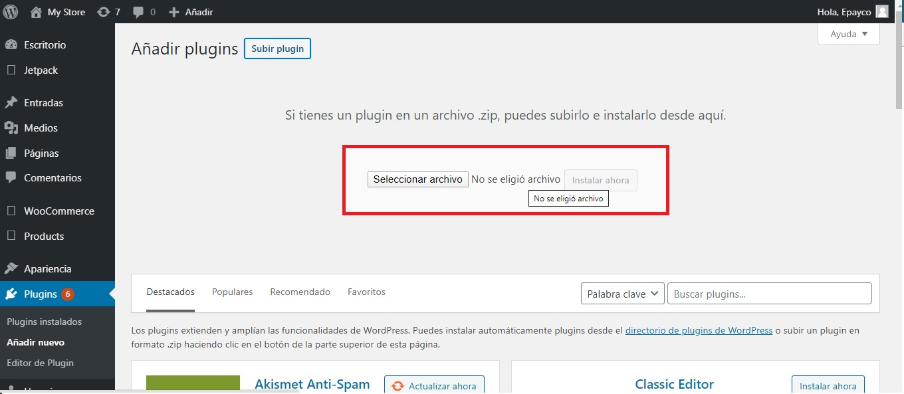
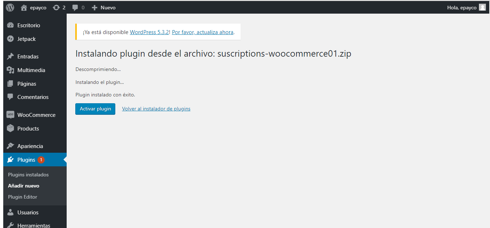
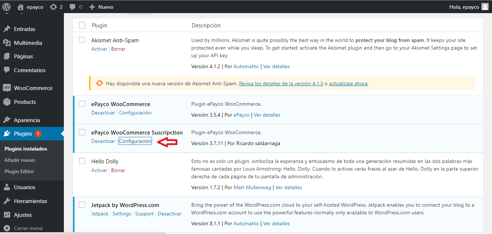
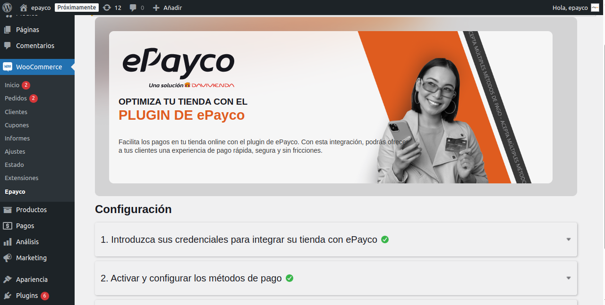

#ePayco plugin para WooCommerce

**Si usted tiene alguna pregunta o problema, no dude en ponerse en contacto con nuestro soporte técnico: desarrollo@payco.co.**

## Tabla de contenido

* [Requisitos](#requisitos)
* [Instalación](#instalación)
* [Pasos](#pasos)
* [Versiones](#versiones)

## Requisitos

* Tener una cuenta activa en [ePayco](https://epayco.com/).
* Tener instalado WordPress versión 5.3.x
* WooCommerce versión 7.7.0 =<.
* WooCommerce versión 2.6.x.
* Acceso a las carpetas donde se encuetra instalado WordPress y WooCommerce.
* Acceso al admin de WordPress.

## Instalación

1. [Descarga el plugin.](https://github.com/epayco/-woocommerce-epayco-api#versiones)
2. Ingresa al administrador de tu wordPress.
3. Ingresa a Plugins / Añadir-Nuevo / Subir-Plugin. 
4. Busca el plugin descargado en tu equipo y súbelo como cualquier otro archivo.
5. Después de instalar el .zip lo puedes ver en la lista de plugins instalados , puedes activarlo o desactivarlo.
6. Para configurar el plugin debes ir a: WooCommerce / Ajustes / Finalizar Compra y Ubica la pestaña ePayco.
7. Configura el plugin ingresando el **P_CUST_ID_CLIENTE**, **PUBLIC_KEY**, **PRIVATE_KEY** y **P_KEY**, los puedes ver en tu [panel de clientes](https://dashboard.epayco.co/login).
8. Selecciona o crea una página de respuesta donde el usuario será devuelto después de finalizar la compra.
9. Realiza una o varias compras para comprobar que todo esté bien.
10. Si todo está bien recuerda cambiar a Proucción y empieza a recibir pagos de forma instantánea y segura con ePayco.

## Pasos

## Versiones
* [ePayco plugin WooCommerce v1.0.0](https://github.com/epayco/-woocommerce-epayco-api/releases/tag/3.0.0).

